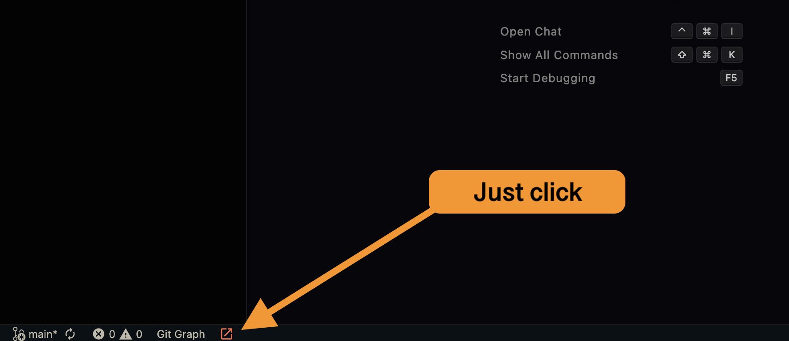

<p align="center">
  
</p>

<h1 align="center">Git Opener</h1>

<p align="center">
  <strong>Open any Git repository in browser with one click</strong>
</p>

<p align="center">
  <a href="https://marketplace.visualstudio.com/items?itemName=Foshati.git-opener">
    
  </a>
  <a href="https://marketplace.visualstudio.com/items?itemName=Foshati.git-opener">
    
  </a>
  <a href="https://github.com/Foshati/git-opener/blob/main/LICENSE">
    
  </a>
</p>

---

## ✨ Features

| Feature | Description |
|---------|-------------|
| 🔗 **Multi-Platform** | GitHub, GitLab, Gitea, Bitbucket, Codeberg, SourceHut & more |
| ⚡ **Self-Contained** | No dependencies on other extensions |
| 🔍 **Auto-Detect** | Automatically detects remote type and platform |
| 🖱️ **Status Bar Button** | One-click to open repository in browser |
| 📁 **Multi-Repo** | Supports projects with multiple Git remotes |
| 📄 **Open File** | Open current file at specific line in browser |

## 📦 Installation

### From Marketplace (Recommended)

1. Open **VS Code**
2. Go to **Extensions** (`Ctrl+Shift+X` / `Cmd+Shift+X`)
3. Search for **"Git Opener"**
4. Click **Install**

Or install via command:
```bash
ext install Foshati.git-opener
```

### 🛠 Manual Installation

For **Cursor**, **Windsurf**, **VSCodium**, or offline installation:

1. Download the `.vsix` file from [Releases](https://github.com/Foshati/git-opener/releases)

2. Install via terminal:
```bash
# VS Code
code --install-extension git-opener-1.1.3.vsix --force

# Cursor
cursor --install-extension git-opener-1.1.3.vsix --force

# VSCodium
codium --install-extension git-opener-1.1.3.vsix --force
```

3. Or drag the `.vsix` file into the Extensions view

## 🚀 Usage

### Status Bar
Click the **orange link icon** ↗️ in the status bar to open the repository in your browser.

### Command Palette
- `Git Open: Open Repository in Browser` - Opens the repository
- `Git Open: Open Current File in Browser` - Opens current file with line number

### ⌨️ Keyboard Shortcuts

| Command | Windows/Linux | macOS |
|---------|---------------|-------|
| Open Repository | `Ctrl+Alt+G` | `Ctrl+Cmd+G` |
| Open File | `Ctrl+Alt+F` | `Ctrl+Cmd+F` |

## ⚙️ Configuration

| Setting | Type | Default | Description |
|---------|------|---------|-------------|
| `git-open.statusBar.enabled` | boolean | `true` | Show button in status bar |
| `git-open.statusBar.alignment` | string | `"left"` | Button alignment (`left` or `right`) |
| `git-open.statusBar.priority` | number | `0` | Button priority (higher = more left) |
| `git-open.preferHttps` | boolean | `true` | Use HTTPS instead of HTTP |

## 🌐 Supported Platforms

- ✅ GitHub
- ✅ GitLab (including self-hosted)
- ✅ Gitea / Forgejo
- ✅ Bitbucket
- ✅ Codeberg
- ✅ SourceHut
- ✅ Azure DevOps
- ✅ Any Git server with web interface

## 📸 Demo



## 🤝 Contributing

Contributions are welcome! Please feel free to submit a Pull Request.

## 📄 License

[MIT](./LICENSE) License © 2024 Foshati

---

<p align="center">
  Made with ❤️ for developers
</p>
